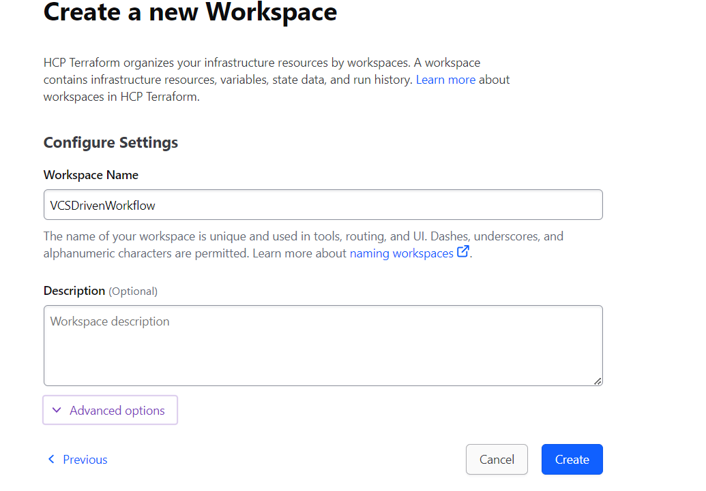

### 21ain.VCS-Driven Workflow

**Steps to Leverage VCS Driven Workflow**

1. Create Workspace: First, we need to create a project, and within that project, we need to create workspaces.

2. Next, we need to select a workflow: either VCS-Driven Workflow, CLI-Driven Workflow, or API-Driven Workflow.

3. Here, things are getting a little complicated. To get our repository name in the list, we need to go to GitHub settings. Inside the settings, navigate to the **Integrations** tab and click on **Applications** . Then, click on the **Installed GitHub Apps** tab and select the **Configure** button next to **Terraform Cloud**.

4. Now, enter the authentication code to proceed.

5. Now, select the repository name, i.e., **VCDrivenWorkflow** , and click the **Save** button.

6. Now, refresh the app.terraform.io page, and you will see the **VCDrivenWorkflow** repository in the list. Now, click on **Next** and then click on the **Create** button.

8. We will end up creating a workspace.

9. Now, let's create the `main.tf`, `provider.tf`, and `variables.tf` files.
10. Now, apply variables set to the **VCSDrivenWorkflow**  wrokflow.

11. Now, the plan will be triggered automatically.

12. Now , click on confirm & apply.

13. Now, Apply is completed
14. In the azure portal

